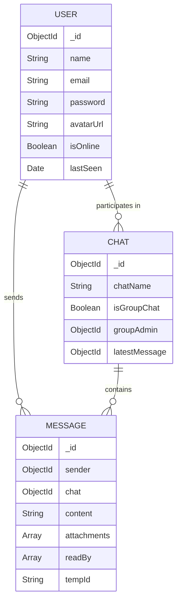

<div align="center">

# 💬 Pulse Chat

### A Modern Real-Time Chat Application

Built with the **MERN Stack** — MongoDB, Express, React (Next.js), Node.js — featuring WebSocket-powered instant messaging, file sharing, group chats, and a premium dark UI.

[](https://nextjs.org/)
[](https://expressjs.com/)
[](https://mongodb.com/)
[](https://socket.io/)
[](https://typescriptlang.org/)

</div>

---

## ✨ Features

### Core Messaging
- **Real-time messaging** — Instant delivery via WebSockets (Socket.io)
- **Optimistic UI updates** — Messages appear instantly before server confirmation
- **Message reconciliation** — Seamless sync between optimistic and server-confirmed messages
- **Infinite scroll** — Paginated message history with smooth loading

### Group & Social
- **1-on-1 chats** — Private conversations between users
- **Group chats** — Create groups, add/remove members, admin controls
- **User search** — Find and connect with users via debounced search
- **Online/Offline presence** — Real-time status tracking across all users

### Communication
- **Typing indicators** — See when someone is typing in real-time
- **Read receipts** — WhatsApp-style double-tick system (✓ sent → ✓✓ delivered → 🔵 read)
- **File sharing** — Upload images, videos, audio, and documents via Cloudinary
- **Media previews** — Inline image display, video player, and audio player in chat

### Security & Auth
- **JWT authentication** — Secure token-based auth with HTTP-only cookies
- **Password hashing** — bcrypt with 12 salt rounds
- **Rate limiting** — API abuse prevention with express-rate-limit
- **Helmet.js** — HTTP security headers

### UI/UX
- **Fully responsive** — Desktop, tablet, and mobile optimized
- **Dark mode** — Premium dark theme with glassmorphism effects
- **Smooth animations** — Micro-interactions and transitions throughout
- **Skeleton loading** — Elegant loading states for all data fetches

---

## 🛠️ Tech Stack

### Frontend
| Technology | Purpose |
|-----------|---------|
| **Next.js 16** | React framework with App Router |
| **TypeScript** | Type-safe development |
| **Zustand** | Lightweight global state management |
| **Socket.io Client** | Real-time WebSocket communication |
| **Axios** | HTTP client with interceptors |
| **Lucide React** | Modern icon library |
| **CSS Custom Properties** | Design system with CSS variables |

### Backend
| Technology | Purpose |
|-----------|---------|
| **Node.js** | Runtime environment |
| **Express 5** | Web framework with async error handling |
| **Socket.io** | Real-time bidirectional communication |
| **MongoDB + Mongoose** | Database with ODM |
| **JWT** | Stateless authentication |
| **Multer** | File upload handling |
| **Cloudinary** | Cloud-based media storage |
| **Helmet + CORS** | Security middleware |

---

## 📁 Project Architecture

```
pulse-chat/
├── backend/
│   ├── config/
│   │   ├── db.js              # MongoDB connection
│   │   └── cloudinary.js      # Cloudinary configuration
│   ├── controllers/
│   │   ├── authController.js  # Register, login, logout
│   │   ├── chatController.js  # Chat CRUD + group management
│   │   ├── messageController.js # Send, fetch, read receipts
│   │   └── userController.js  # User search
│   ├── middleware/
│   │   ├── auth.js            # JWT verification middleware
│   │   └── upload.js          # Multer file upload config
│   ├── models/
│   │   ├── User.js            # User schema
│   │   ├── Chat.js            # Chat schema (1v1 + group)
│   │   └── Message.js         # Message schema with attachments
│   ├── routes/
│   │   ├── authRoutes.js
│   │   ├── chatRoutes.js
│   │   ├── messageRoutes.js
│   │   └── userRoutes.js
│   ├── utils/
│   │   └── generateToken.js   # JWT token generator
│   └── server.js              # Express + Socket.io entry point
│
├── frontend/
│   └── src/
│       ├── app/
│       │   ├── page.tsx       # Auth page (login/register)
│       │   ├── chat/page.tsx  # Main chat dashboard
│       │   ├── globals.css    # Design system + responsive styles
│       │   └── layout.tsx     # Root layout with metadata
│       ├── components/
│       │   ├── Avatar.tsx     # Gradient avatar with online status
│       │   ├── ChatArea.tsx   # Message list with infinite scroll
│       │   ├── ChatHeader.tsx # Chat info + back button (mobile)
│       │   ├── EmptyState.tsx # Welcome screen
│       │   ├── GroupModal.tsx # Group chat creation modal
│       │   ├── MessageBubble.tsx # Message with read receipts
│       │   ├── MessageInput.tsx  # Input with file upload
│       │   └── Sidebar.tsx    # Chat list + user search
│       ├── lib/
│       │   ├── api.ts         # Axios instance + API methods
│       │   ├── socket.ts      # Socket.io client manager
│       │   └── utils.ts       # Helper functions
│       └── store/
│           ├── authStore.ts   # Auth state (Zustand)
│           └── chatStore.ts   # Chat/message state (Zustand)
└── README.md
```

---

## 🗄️ Database Schema



---

## 🔌 Real-Time Events (Socket.io)

| Event | Direction | Description |
|-------|-----------|-------------|
| `setup` | Client → Server | User connects and joins personal room |
| `join_chat` | Client → Server | User enters a specific chat room |
| `new_message` | Client → Server | Broadcast new message to chat participants |
| `message_received` | Server → Client | Deliver message to recipient |
| `typing` | Bidirectional | Typing indicator start |
| `stop_typing` | Bidirectional | Typing indicator stop |
| `message_read` | Bidirectional | Read receipt notification |
| `user_online` | Server → Client | User online/offline status change |
| `online_users` | Server → Client | Full list of online user IDs |

---

## 🚀 Getting Started

### Prerequisites
- Node.js 18+
- MongoDB (local or Atlas)
- Cloudinary account (for file uploads)

### 1. Clone the repository
```bash
git clone https://github.com/kratos183/pulse-chat.git
cd pulse-chat
```

### 2. Setup Backend
```bash
cd backend
npm install
```

Create `backend/.env`:
```env
PORT=5000
MONGO_URI=mongodb://127.0.0.1:27017/chatapp
JWT_SECRET=your_jwt_secret_here
JWT_EXPIRES_IN=7d
NODE_ENV=development
CLIENT_URL=http://localhost:3000
CLOUDINARY_CLOUD_NAME=your_cloud_name
CLOUDINARY_API_KEY=your_api_key
CLOUDINARY_API_SECRET=your_api_secret
```

### 3. Setup Frontend
```bash
cd frontend
npm install
```

Create `frontend/.env.local`:
```env
NEXT_PUBLIC_API_URL=http://localhost:5000
```

### 4. Run the application
```bash
# Terminal 1 — Backend
cd backend
npm run dev

# Terminal 2 — Frontend
cd frontend
npm run dev
```

Open [http://localhost:3000](http://localhost:3000) in your browser.

---

## 🌐 Deployment

| Service | Platform | URL |
|---------|----------|-----|
| Frontend | Vercel | [pulse-chat.vercel.app](https://pulse-chat.vercel.app) |
| Backend | Render | Render Web Service |
| Database | MongoDB Atlas | Cloud Cluster |
| Media Storage | Cloudinary | Cloud CDN |

---

## 📸 Key Implementation Highlights

### Optimistic UI Pattern
Messages appear instantly in the UI with a temporary ID. Once the server confirms, the message is reconciled — replacing the optimistic version with the real one. Failed messages are marked with an error indicator.

### Conditional Multer Middleware
The message route dynamically applies file upload middleware only when the request contains `multipart/form-data`, preventing interference with JSON text messages on Express 5.

### Responsive Mobile-First Design
On mobile devices, the sidebar and chat area use absolute positioning with CSS transitions. Selecting a chat slides the sidebar away and reveals the full-screen chat. A back button returns to the sidebar.

### Zustand State Management
Two lightweight stores manage all application state without the boilerplate of Redux — `authStore` for authentication and `chatStore` for chats, messages, typing indicators, and online presence.

---

## 📄 API Endpoints

### Authentication
| Method | Endpoint | Description |
|--------|----------|-------------|
| POST | `/api/auth/register` | Create new account |
| POST | `/api/auth/login` | Sign in |
| POST | `/api/auth/logout` | Sign out |
| GET | `/api/auth/me` | Get current user |

### Users
| Method | Endpoint | Description |
|--------|----------|-------------|
| GET | `/api/users?search=` | Search users by name/email |

### Chats
| Method | Endpoint | Description |
|--------|----------|-------------|
| GET | `/api/chats` | Get all user's chats |
| POST | `/api/chats` | Access/create 1-on-1 chat |
| POST | `/api/chats/group` | Create group chat |
| PUT | `/api/chats/group/add` | Add member to group |
| PUT | `/api/chats/group/remove` | Remove member from group |

### Messages
| Method | Endpoint | Description |
|--------|----------|-------------|
| GET | `/api/messages/:chatId` | Get messages (paginated) |
| POST | `/api/messages` | Send message (text or file) |
| PUT | `/api/messages/read/:chatId` | Mark messages as read |

---

## 🤝 Contributing

1. Fork the repository
2. Create your feature branch (`git checkout -b feature/amazing-feature`)
3. Commit your changes (`git commit -m 'Add amazing feature'`)
4. Push to the branch (`git push origin feature/amazing-feature`)
5. Open a Pull Request

---

## 📝 License

This project is open source and available under the [MIT License](LICENSE).

---

<div align="center">

**Built with ❤️ by [kratos183](https://github.com/kratos183)**

</div>
